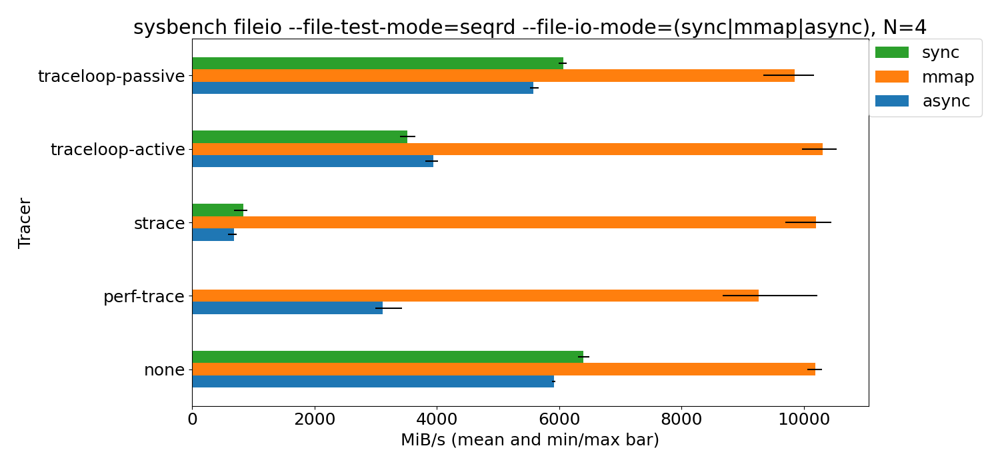

# traceloop

traceloop is a command line tool to trace system calls in a similar way to
strace but with some differences:
- traceloop uses BPF instead of ptrace
- traceloop's tracing granularity is the control group (cgroup) instead of a
  process
- traceloop's traces are recorded in a fast, in-memory, overwritable ring
  buffer like a flight recorder. The tracing could be permanently enabled and
  inspected in case of crash.

traceloop can be used directly on the command line or via an HTTP interface.

traceloop has been written to trace Kubernetes Pods with [Inspektor
Gadget](https://github.com/kinvolk/inspektor-gadget), but it can as easily be
used with systemd services that are in their own control groups (look for
`.service` and `.scope` directories inside `/sys/fs/cgroup/unified/`).

## On the command line

Example with an existing systemd service:
```
sudo -E ./traceloop cgroups /sys/fs/cgroup/unified/system.slice/sshd.service
```

Example with a custom command:
```
sudo systemd-run -t  --unit=test42.service  /bin/sh -c 'for i in $(seq 1 1000) ; do sleep 4 ; echo 2*3*7 | bc > /dev/null ; echo Multiplication $i done. ; done'
...
sudo -E ./traceloop cgroups /sys/fs/cgroup/unified/system.slice/test42.service
...
00:04.022260640 cpu#0 pid 23981 [bc] brk(brk=0) = 94045092683776
00:04.022346588 cpu#0 pid 23981 [bc] ioctl(fd=0, cmd=21505, arg=140721805741680) = 18446744073709551591
00:04.022361201 cpu#0 pid 23981 [bc] read(fd=0, buf=94045092586128 "2*3*7\n", count=8192) = 6
00:04.022401517 cpu#0 pid 23981 [bc] fstat() = 0
00:04.022414650 cpu#0 pid 23981 [bc] ioctl(fd=1, cmd=21505, arg=140721805741312) = 18446744073709551591
00:04.022440173 cpu#0 pid 23981 [bc] write(fd=1, buf=94045092602832 "42\n", count=3) = 3
00:04.022460351 cpu#0 pid 23981 [bc] read(fd=0, buf=94045092586128 "", count=8192) = 0
00:04.022475888 cpu#0 pid 23981 [bc] ioctl(fd=0, cmd=21505, arg=140721805741616) = 18446744073709551591
00:04.022525326 cpu#0 pid 23981 [bc] exit_group(error_code=0)...
00:04.022833827 cpu#2 pid 23961 [sh] ...wait4() = 23981
```


## With Docker

```
docker run --rm -v /sys/kernel/debug:/sys/kernel/debug -v /sys/fs/cgroup:/sys/fs/cgroup -v /sys/fs/bpf:/sys/fs/bpf -v /run:/run --privileged kinvolk/traceloop
```

## With HTTP interface

```
sudo -E ./traceloop serve
...

$ sudo curl --unix-socket /run/traceloop.socket 'http://localhost/add?name=sshd&cgrouppath=/sys/fs/cgroup/unified/system.slice/sshd.service'
added as id 0
$ sudo curl --unix-socket /run/traceloop.socket 'http://localhost/list'
0: [sshd] /sys/fs/cgroup/unified/system.slice/sshd.service
$ sudo curl --unix-socket /run/traceloop.socket 'http://localhost/dump-by-cgroup?cgroup=/sys/fs/cgroup/unified/system.slice/sshd.service'
...

```

### Talk at Linux Plumbers Conference 2020

A comprehensive presentation was held at LPC 2020 in the Networking and BPF Summit.
See the slides [here](https://linuxplumbersconf.org/event/7/contributions/667/attachments/510/919/Traceloop_and_BPF_Linux_Plumbers_Conference_-_LPC_2020.pdf).

After feedback to include a comparison to `perf trace` we reran the benchmark but omitted the synchronous write syscall case that logs the buffer contents because dumping the buffers is not implemented in `perf trace`. Here the results:


